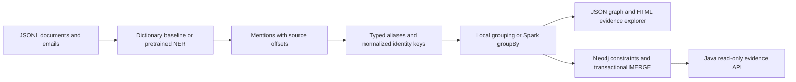

# EntityGraph

**Trace corporate entities and explicit payments back to the words that support them.**

EntityGraph turns document and email text into a reproducible knowledge graph, keeping every mention's document ID and character offsets. It demonstrates entity extraction, conservative resolution, graph modeling, and a Java evidence API on a small, entirely synthetic corporate corpus.

The default demo runs on CPU with Python's standard library. Optional integrations use Hugging Face Transformers / Tokenizers, Apache Spark, and Neo4j. **No model was fine-tuned for this project, and no enterprise-scale or accuracy benchmark is claimed.**

## Architecture



| Component | Actual implementation |
|---|---|
| Python | Input validation, longest-match dictionary extraction, narrow payment grammar, stable IDs, escaped searchable HTML report |
| Hugging Face | Optional pretrained token-classification pipeline; fast Tokenizers and overlapping overflow windows; CPU inference |
| Resolution | Entity type + Unicode-normalized key, explicit aliases, ambiguity rejection; no fuzzy identity guesses |
| Spark | Optional DataFrame grouping with deterministic canonical-name selection, parity check against local output |
| Neo4j | Four uniquely constrained node types, mention lineage and payment relationships, parameterized transactional writes |
| Java 17 | Localhost HTTP API with bounded result sets, parameterized read queries, input validation and safe error responses |

## Quick start

Requires Python 3.11+. From the repository root:

```sh
python -m entitygraph.cli --output artifacts
python -m unittest discover -s tests -p 'test_*.py' -v
```

Open `artifacts/report.html` in a browser. The report contains searchable mention lineage, source documents, and explicit payment evidence. `artifacts/graph.json` is the machine-readable result. It is generated from the input, never a canned model output.

For an installed CLI: `python -m pip install .`, then `entitygraph`.

### Supply documents

Input is UTF-8 JSONL with a unique nonempty string `id`, string `text`, and optional `kind` on each line. Duplicate IDs, malformed JSON and documents over one million characters fail with a line number. See [synthetic documents](fixtures/documents.jsonl) and [alias configuration](fixtures/aliases.json).

```sh
python -m entitygraph.cli --input fixtures/documents.jsonl --aliases fixtures/aliases.json --output artifacts
```

The baseline only recognizes configured aliases. Its score of 1.0 means an exact dictionary match, **not** calibrated NER or identity confidence. Unknown names remain unrecognized. Type is part of identity, so a person and a location with the same name remain separate.

### Neo4j and Java API

Requires Docker Compose, Java 17 and Maven. Set `NEO4J_PASSWORD` in your shell to a local development password; do not commit it. For PowerShell use `$env:NEO4J_PASSWORD = 'your-local-password'`; for bash use `export NEO4J_PASSWORD='your-local-password'`.

```sh
docker compose up -d
python -m pip install '.[graph]'
python -m entitygraph.cli --neo4j
mvn -f java/pom.xml test exec:java
```

After Neo4j is ready, open `http://localhost:7474`. The Java API binds only to `127.0.0.1:8080`: `GET /entities` returns up to 100 entities; `GET /entities?id=<entity-id>` returns up to 100 source mentions. Obtain IDs from the list endpoint or graph JSON. See [Cypher examples](docs/queries.cypher).

### Spark resolution

Requires Java 17 and PySpark. Spark distributes the grouping stage; extraction and final graph assembly currently remain on the driver.

```sh
python -m pip install '.[spark]'
python -m entitygraph.cli --resolver spark
```

### Actual pretrained NER

This downloads model weights and installs substantial dependencies. It is an optional real inference path, separate from the offline demo:

```sh
python -m pip install '.[model]'
python -m entitygraph.cli --extractor model --model dslim/bert-base-NER --revision main
```

Pin `--revision` to a model commit for reproducibility. The adapter preserves original character spans and accepts PER/ORG/LOC predictions; other tags are omitted. Entity resolution still uses aliases or exact normalized names. No fine-tuning, held-out model evaluation, or model accuracy result is included. Review the upstream model card and license before downloading or redistributing weights.

## Verification and measured demo

The four synthetic documents resolve to **8 entities and 2 explicit payments**. These counts describe fixtures, not general extraction quality. The test suite covers span fidelity, alias collapse, type isolation, deterministic replay, word boundaries, empty input, invalid input, alias collisions, and HTML escaping.

CI runs the offline pipeline and uploads its real JSON/HTML outputs. A second job runs Spark/local parity, imports the graph into a disposable Neo4j twice, verifies counts and lineage, builds/tests Java, and exercises its live HTTP endpoint. See [verification notes](docs/verification.md) for the exact observed status; workflow configuration alone is not evidence of success.

## Design decisions and limitations

- Explicit aliases favor auditability over recall. Equal normalized names of the same type merge, which can falsely join different real people. There is no probabilistic linkage or human review queue.
- Payments are recognized only as `<known organization> paid <known organization> USD <amount>`. Amounts remain decimal strings. Co-occurrence does not establish employment, ownership, or a financial relationship.
- Import replay is idempotent for identical input. Changed/deleted documents do not remove previous mentions or entities; use a fresh database for a new snapshot. IDs are truncated SHA-256 values without collision detection.
- All documents and output are held in memory. Spark grouping does not make the entire application a distributed ingestion system; no throughput, large-corpus, or fault-tolerance claims are made.
- Neo4j import is one transaction and is intended for small batches. Uniqueness constraints support indexed identity lookup; no query-plan benchmark was performed.
- The Java API is a local demonstration without authentication, pagination, rate limits or production deployment. It must not be exposed publicly as-is.
- Inputs must already be text: PDF parsing, mailbox connectors, OCR, streaming ingestion, PII redaction and access-control enforcement are outside scope. Generated reports contain original source text.
- Model mode may produce different entity boundaries and therefore different payment results from the dictionary mode. It has no project-specific accuracy evaluation.

## Portfolio evidence

- Built a provenance-preserving Python graph pipeline with deterministic typed entity resolution and a searchable source-evidence report.
- Implemented optional Spark grouping and transactional Neo4j imports, with automated parity and replay checks.
- Built a Java 17 read-only graph API with validated identifiers and parameterized Cypher queries.

These are implementation statements, not production-scale or accuracy claims.

## License and data

Project code and the original synthetic fixtures are MIT licensed. All people, companies and payments in the fixture are fictional; email addresses use reserved `.example` domains. No private documents or credentials are included. Dependencies retain their upstream licenses; model weights and Neo4j binaries are not redistributed. See [dependency notes](docs/dependencies.md).
